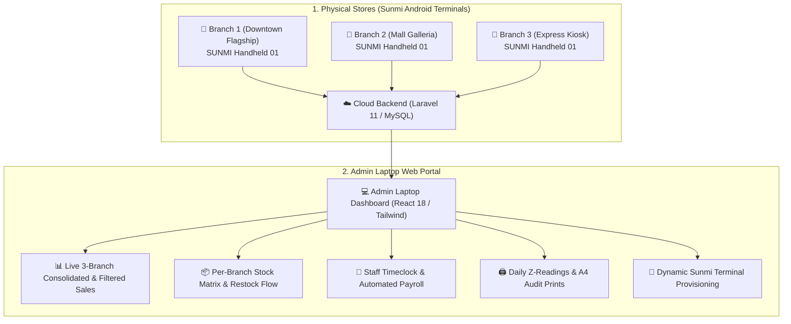

# 🚀 Sunmi Multi-Branch Cloud POS & Handheld Ecosystem

An enterprise-ready, modular Point of Sale (POS) system engineered specifically for **Sunmi Android Handheld Terminals (V2/V2s/V2 Pro)** across **3 Physical Branches** (dynamically expandable), coupled with a **Real-Time Admin Laptop Web Dashboard**.

---

## 🌟 Key Architecture & Capabilities



---

## 📁 Repository Structure

* **[`backend/`](file:///home/pheinz/Sunmi-MultiBranch-POS/backend)**: PHP 8.3 / Laravel 11 Cloud REST API engine with multi-branch database schema, pessimistic inventory row locking (`lockForUpdate`), cashier PIN auth, timeclock tracking, payroll computations, and 58mm Z-report formatters.
* **[`pos-mobile/`](file:///home/pheinz/Sunmi-MultiBranch-POS/pos-mobile)**: Expo / React Native client optimized for low-memory (1GB-2GB RAM) Sunmi Handheld terminals with Hermes JS, `@shopify/flash-list`, Zustand state management, 58mm thermal receipt printing, and offline fallback queueing.
* **[`admin-web/`](file:///home/pheinz/Sunmi-MultiBranch-POS/admin-web)**: Modern React 18 + Tailwind CSS web dashboard for the business owner's laptop/desktop with live branch switching (`All Branches` vs `Branch 1/2/3`), date range filtering (`Today`, `Week`, `Month`), restocking, payroll generator, and thermal/A4 print views.

---

## 🧪 Testing & Verification

Run the full PHPUnit backend feature test suite:
```bash
cd backend
./vendor/bin/phpunit
```
*Tests verify:* Multi-branch data isolation, Sunmi device provisioning, atomic checkout deductions, restocking adjustments, cashier shifts & Z-readings, and staff payroll calculations.

---

## 🚀 Running the Applications

### 1. Launch Admin Web Dashboard (Laptop)
```bash
cd admin-web
npm run dev
```
Open `http://localhost:3000` in any browser on your laptop.

### 2. Launch Sunmi Handheld Mobile POS (Expo)
```bash
cd pos-mobile
npm run web   # Or: npx expo start --android
```
